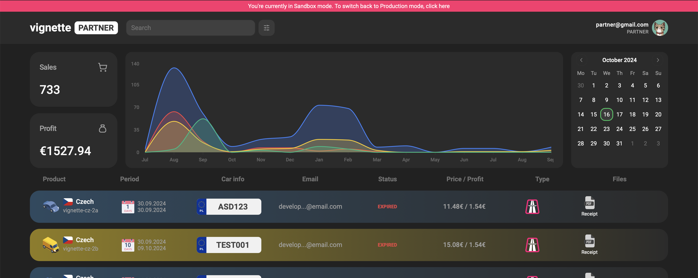

## Partner Panel

We highly appreciate our collaboration with partners and have therefore developed a dedicated Partner Panel.

This tool facilitates testing during the integration phase.
The Partner Panel also serves as a valuable resource for analytics and accessing order details.

To log in, please use the link below along with the email address you provided in the partner form:

[**Partner Panel login page**](https://www.e-vignette.app)

We continuously add new features to the Partner Panel to enhance your collaboration experience with us.

# **Settings**

## Profile

Here you can add aditional user and role, change Company information, see our agreement and more.

## For Developers

In this section, you can view your API access keys.  
We have separated `SANDBOX` and `PRODUCTION` environments, so please ensure you're using the correct one.

Additionally, we’ve introduced extra settings, such as:

- Webhook URL

  You can select which information do you need get about orders

- Success redirect URL
- Error redirect URL

# **Analytic**

# **Orders**

# **Notification**

`soon` In this section, you will receive system-related information: updates, maintenance, and other important notices.
${env.GITHUB_URL}

#

